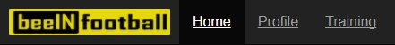
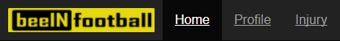
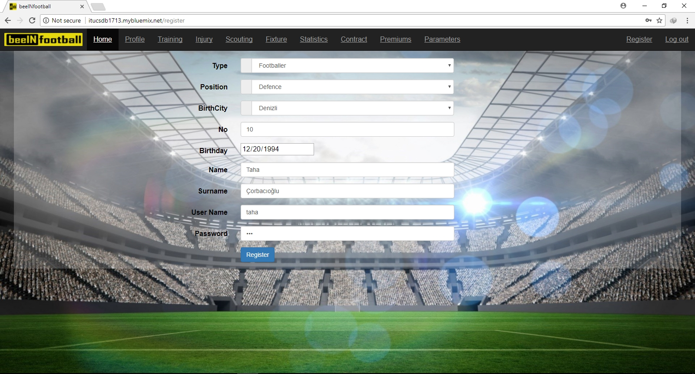
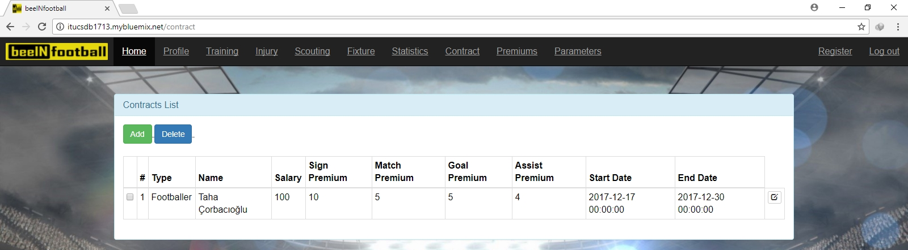

Mehmet Taha Çorbacıoğlu Tarafından Yapılan Kısımlar
===================================================

Kullanıcı Girişi
----------------

Bu sayfada kullanıcıların sisteme girişleri ve giriş kontrolleri yapılmaktadır. Sistem ilk açıldığında sadece yönetici hesabı önceden tanımlı bir şekilde bulunmaktadır. Siteye sadece kulüp üyelerinin katılması istendiği için, siteye giriş yapmak isteyen kişiler yöneticiler tarafından önceden sisteme kayıt edilmesi gerekmektedir. Giriş yapmadan adres satırından sitenin başka sayfalarına girmeye çalışanlar da bu sayfaya yönlendirilmektedir.

.. figure:: images/login.jpg
      :alt: Giriş Sayfası

Ana Sayfa
---------

Giriş yapan kullanıcılar bu sayfaya yönlendirilmektedir. Gezinti çubuğu(navbar) aracılığı ile kullanıcılar yekileri olan sayfalara gidebilmektedir.

Yöneticiler İçin
^^^^^^^^^^^^^^^^

Yöneticiler her sayfaya erişimleri oldukları için gezinti çubuğu aracılığı ile diğer tüm sayfalara erişim sağlayabilmektedir.

.. figure:: images/home-admin.jpg
      :alt: Ana Sayfa

Antrenörler İçin
^^^^^^^^^^^^^^^^

Antrenörler sadece profil ve training sayfalarına erişim sağlayabilmektedir.

Ssğlıkçılar İçin
^^^^^^^^^^^^^^^^

Sağlıkçkılar sadece profil ve injury sayfalarına erişim sağlayabilmektedir.

Gözlemciler İçin
^^^^^^^^^^^^^^^^

Gözlemciler sadece profil ve scouting sayfalarına erişim sağlayabilmektedir.

.. figure:: images/navbar-scout.jpg
      :alt: Gözlemciler için navbar

Futbolcular İçin
^^^^^^^^^^^^^^^^

Futbolcular sadece kendi profillerini görüntüleyebilecektir.

.. figure:: images/navbar-footballer.jpg
      :alt: Futbolcular için navbar

Hata Sayfası
------------

Eğer kullanıcılar erişim izni olmadıkları bir sayfaya girmeye çalışırlarsa izin hatası alacaktırlar.

Kullanıcı Kaydı
---------------

Sistem kulüp bazlı çalıştığı için dışarıdan kayıt engellenmiştir. Kayıt olmak için yönetici ile iletişime geçmek ve ardından yöneticinin kayıt sayfası aracılığı ile yeni kullanıcı oluşturması gerekmektedir. Yeni kullanıcı oluştururken, yöneticinin girmesinin zorunlu olduğu kısımlar, kullanıcı adı ve şifresi bölümüdür. Kullancı oluşturulduktan sonra ister kullanıcı, isterse yönetici kullanıcı bilgilerini güncelleyebilir.

Profil Sayfası
--------------

Kullanıcılar bu sayfa aracılığı ile bilgilerine ulaşabilir, güncelleyebilir ve isterlerse hesaplarını silebilirler.

Yöneticiler İçin
^^^^^^^^^^^^^^^^

Yöneticiler diğer kullanıcıların haricinde, sayfanın üst kısmında bulunan liste aracılığı ile diğer kullacıları seçip onların hesap bilgilerini güncelleyebilir veya hesaplarını silebilir.

Futbolcular İçin
^^^^^^^^^^^^^^^^

Futbolcular kendi profillerinde, diğer kullanıcı tiplerinin futbolculara girmiş oldukları bilgileri görebilmektedir. Bunlar: kontrat bilgileri, istatistikler, sakatlık bilgisi, antreman ve prim bilgileridir. Aynı zamanda diğer kullanıcılar gibi kendi profillerini güncelleyebilir veya silebilir.

Diğer Kullacı Tipleri İçin
^^^^^^^^^^^^^^^^^^^^^^^^^^

Diğer kullıcı tipleri, bu sayfada sadece kendi bilgilerini güncelleyebilir veya hesaplarını silebilir.

.. figure:: images/profile-other.jpg
      :alt: Diğer Profil Görünümleri

Kullanıcı Bilgilerinin Güncellenmesi
------------------------------------

Kullanıcılar profil sayfasındaki update butonu aracılığı ile kendi bilgilerini güncelleyebilir. Yöneticiler buna ek olarak başka hesapları da güncelleyebilir.

.. figure:: images/profile-update.jpg
      :alt: Profil Güncellenmesi

Kullanıcının Silinmesi
----------------------

Kullanıcılar profillerinde bulunan delete butonu ile hesaplarını silebilir.

.. figure:: images/profile-delete.jpg
      :alt: Hesap Silinmesi

Yönetici Tarafından Kullancının Silinmesi
^^^^^^^^^^^^^^^^^^^^^^^^^^^^^^^^^^^^^^^^^

Kullanıcı profil sayfasından istediği kullanıcığı seçtikten sonra update butonu ile güncelleme sayfasına giderler. Burada update butonunun altında yer alan delete butonu ile seçtikleri hesabı silebilirler.

Futbolcular için Sakatlık Bilgisi
---------------------------------

Yöneticiler ve sağlıkçılar bu sayfa aracılığı ile takımın mevcut sağlık durumunu inceleyebilirler.

Sakatlık Bilgisinin Eklenmesi
^^^^^^^^^^^^^^^^^^^^^^^^^^^^^

Yönetici veya sağlıkçı sakatlık sayfasında yer alan add butonu ile oyunculara sakatlık bilgisi girebilir. Bunun için sistemde en bir futbolcunun kayıtlı olması gerekmektedir. Buraya tahmini iyileşme süresinin, sakatlık ne olduğu ve sakatlık bölgesini girebilirler.

Sakatlık Bilgisinin Güncellenmesi
^^^^^^^^^^^^^^^^^^^^^^^^^^^^^^^^^

Yönetici veya sağlıkçı, sakatlık sayfasında her sakatlığın yanında bulunan update butonu ile önceden girilen bir sakatlığı güncelleyebilirler. Yanlış girilmiş bir sakatlık değiştirebilecekleri gibi tahmini süreyi de değiştirebilirler.

.. figure:: images/injury-update.jpg
      :alt: Sakatlık Güncellenmesi

Sakatlık Bilgisinin Silinmesi
^^^^^^^^^^^^^^^^^^^^^^^^^^^^^^

Yönetici veya sağlıkçılar, sakatlık sayfasında yer alan delete butonu ile her sakatlığın solunda yer alan işaratçiler ile seçtikleri sakatlıkları silebilirler.

Kontrat Bilgileri
-----------------

Yöneticiler bu sayfa aracılığı ile sistemdeki futbolcular ile imzaladıkları sözleşmelerin detaylarını sisteme ekleyebilirler, tüm sözleşmeleri görüntüleyebilir, güncelleyebilir veya silebilirler.

Kontrat Bilgilerinin Eklenmesi
^^^^^^^^^^^^^^^^^^^^^^^^^^^^^^

Yöneticiler kontrat sayfasında yer alan add butonu ile futbolcular ile imzaladıkları sözleşmelerin bilgisini girebilir. Bunun için sistemde en bir futbolcunun kayıtlı olması gerekmektedir. Buraya maaş bilgisini, imza primini, maç, gol ve assist primlerini girerler. Sözleşmenin imzalanma tarihini ve bitiş süresini de yine buradan eklerler.

Kontrat Bilgilerinin Güncellenmesi
^^^^^^^^^^^^^^^^^^^^^^^^^^^^^^^^^^

Yöneticiler, kontrat sayfasında her sözleşmenin yanında bulunan update butonu ile önceden girilen bir sözleşmeyi güncelleyebilirler. Yanlış girilmiş bir sözleşmeyi değiştirebilirler.

Kontrat Bilgilerinin Silinmesi
^^^^^^^^^^^^^^^^^^^^^^^^^^^^^^

Yöneticiler, kontrat sayfasında yer alan delete butonu ile her sözleşmenin solunda yer alan işaratçiler ile seçtikleri sözleşmeleri silebilirler.

İstatistik Bilgileri
--------------------

Yöneticiler bu sayfa aracılığı ile sistemdeki futbolcular için istatistik ekleyebilir, tüm futbolcuların istatistik bilgilerine ulaşabilirler, güncelleyebilir veya silebilirler.

İstatistik Bilgilerinin Eklenmesi
^^^^^^^^^^^^^^^^^^^^^^^^^^^^^^^^^

Yöneticiler istatistik sayfasında yer alan add butonu ile futbolcular için istatistik bilgisi ekleyebilirler. Bunun için sistemde en bir futbolcunun kayıtlı olması gerekmektedir. Buraya maç, gol ve assist bilgilerini girerler.

İstatistik Bilgilerinin Güncellenmesi
^^^^^^^^^^^^^^^^^^^^^^^^^^^^^^^^^^^^^

Yöneticiler, istatistik sayfasında her istatistiğin yanında bulunan update butonu ile önceden girilen bir istatistiği güncelleyebilirler. Yanlış girilmiş bir istatistiği değiştirebilirler.

İstatistik Bilgilerinin Silinmesi
^^^^^^^^^^^^^^^^^^^^^^^^^^^^^^^^^

Yöneticiler, istatistik sayfasında yer alan delete butonu ile her istatistiğin solunda yer alan işaratçiler ile seçtikleri istatistikleri silebilirler.
