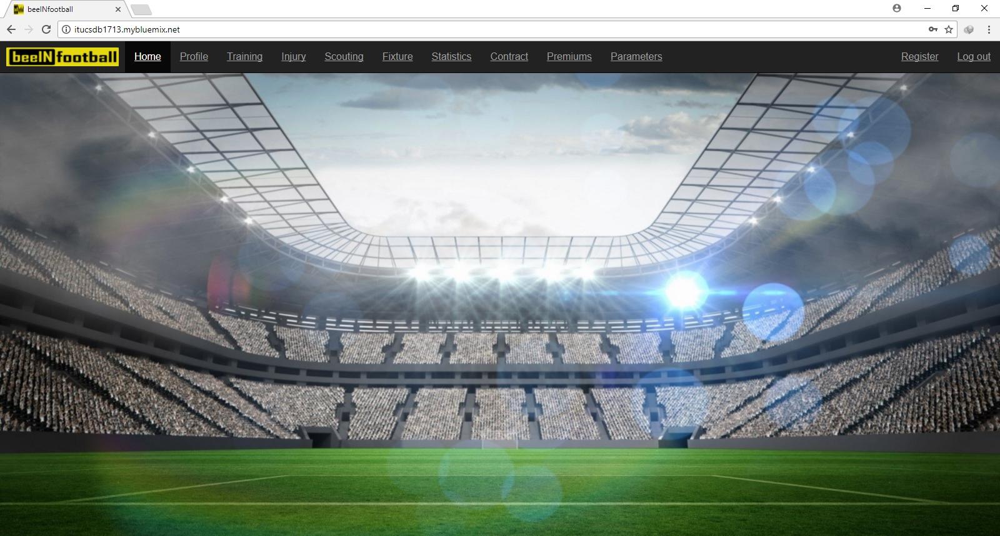

Mehmet Taha Çorbacıoğlu Tarafından Yapılan Kısımlar
===================================================

Kullanıcı Girişi
----------------

Bu sayfada kullanıcıların sisteme girişleri ve giriş kontrolleri yapılmaktadır. Sistem ilk açıldığında sadece yönetici hesabı önceden tanımlı bir şekilde bulunmaktadır. Siteye sadece kulüp üyelerinin katılması istendiği için, siteye giriş yapmak isteyen kişiler yöneticiler tarafından önceden sisteme kayıt edilmesi gerekmektedir. Giriş yapmadan adres satırından sitenin başka sayfalarına girmeye çalışanlar da bu sayfaya yönlendirilmektedir.

.. figure:: images/login.jpg
      :alt: Giriş Sayfası

Ana Sayfa
---------

Giriş yapan kullanıcılar bu sayfaya yönlendirilmektedir. Gezinti çubuğu(navbar) aracılığı ile kullanıcılar yekileri olan sayfalara gidebilmektedir.

Yöneticiler İçin
^^^^^^^^^^^^^^^^

Yöneticiler her sayfaya erişimleri oldukları için gezinti çubuğu aracılığı ile diğer tüm sayfalara erişim sağlayabilmektedir.

Antrenörler İçin
^^^^^^^^^^^^^^^^

Antrenörler sadece profil ve training sayfalarına erişim sağlayabilmektedir.

.. figure:: images/navbar-trainer.jpg
      :alt: Antrenörler için navbar

Ssğlıkçılar İçin
^^^^^^^^^^^^^^^^

Sağlıkçkılar sadece profil ve injury sayfalarına erişim sağlayabilmektedir.

.. figure:: images/navbar-doctor.jpg
      :alt: Sağlıkçılar için navbar

Gözlemciler İçin
^^^^^^^^^^^^^^^^

Gözlemciler sadece profil ve scouting sayfalarına erişim sağlayabilmektedir.

Futbolcular İçin
^^^^^^^^^^^^^^^^

Futbolcular sadece kendi profillerini görüntüleyebilecektir.

.. figure:: images/navbar-footballer.jpg
      :alt: Futbolcular için navbar

Kullanıcı Kaydı
---------------

Sistem kulüp bazlı çalıştığı için dışarıdan kayıt engellenmiştir. Kayıt olmak için yönetici ile iletişime geçmek ve ardından yöneticinin kayıt sayfası aracılığı ile yeni kullanıcı oluşturması gerekmektedir. Yeni kullanıcı oluştururken, yöneticinin girmesinin zorunlu olduğu kısımlar, kullanıcı adı ve şifresi bölümüdür. Kullancı oluşturulduktan sonra ister kullanıcı, isterse yönetici kullanıcı bilgilerini güncelleyebilir.

.. figure:: images/register.jpg
      :alt: Kullanıcı Kaydı

Profil Sayfası
--------------

Kullanıcılar bu sayfa aracılığı ile bilgilerine ulaşabilir, güncelleyebilir ve isterlerse hesaplarını silebilirler.

Yöneticiler İçin
^^^^^^^^^^^^^^^^

Yöneticiler diğer kullanıcıların haricinde, sayfanın üst kısmında bulunan liste aracılığı ile diğer kullacıları seçip onların hesap bilgilerini güncelleyebilir veya hesaplarını silebilir.

.. figure:: images/profile-admin.jpg
      :alt: Yönetici Profili

Futbolcular İçin
^^^^^^^^^^^^^^^^

Futbolcular kendi profillerinde, diğer kullanıcı tiplerinin futbolculara girmiş oldukları bilgileri görebilmektedir. Bunlar: kontrat bilgileri, istatistikler, sakatlık bilgisi, antreman ve prim bilgileridir. Aynı zamanda diğer kullanıcılar gibi kendi profillerini güncelleyebilir veya silebilir.

.. figure:: images/profile-footballer.jpg
      :alt: Futbolcu Profili

Diğer Kullacı Tipleri İçin
^^^^^^^^^^^^^^^^^^^^^^^^^^

Diğer kullıcı tipleri, bu sayfada sadece kendi bilgilerini güncelleyebilir veya hesaplarını silebilir.

Kullanıcı Bilgilerinin Güncellenmesi
------------------------------------

Kullanıcılar profil sayfasındaki update butonu aracılığı ile kendi bilgilerini güncelleyebilir. Yöneticiler buna ek olarak başka hesapları da güncelleyebilir.

Kullanıcının Silinmesi
----------------------

Kullanıcılar profillerinde bulunan delete butonu ile hesaplarını silebilir.

Yönetici Tarafından Kullancının Silinmesi
^^^^^^^^^^^^^^^^^^^^^^^^^^^^^^^^^^^^^^^^^

Kullanıcı profil sayfasından istediği kullanıcığı seçtikten sonra update butonu ile güncelleme sayfasına giderler. Burada update butonunun altında yer alan delete butonu ile seçtikleri hesabı silebilirler.

Futbolcular için Sakatlık Bilgisi
---------------------------------

Sakatlık Bilgisinin Eklenmesi
^^^^^^^^^^^^^^^^^^^^^^^^^^^^^

Sakatlık Bilgisinin Güncellenmesi
^^^^^^^^^^^^^^^^^^^^^^^^^^^^^^^^^

Sakatlık Bilgisinin Silinmesi
^^^^^^^^^^^^^^^^^^^^^^^^^^^^^^

Kontrat Bilgileri
-----------------

Kontrat Bilgilerinin Eklenmesi
^^^^^^^^^^^^^^^^^^^^^^^^^^^^^^

Kontrat Bilgilerinin Güncellenmesi
^^^^^^^^^^^^^^^^^^^^^^^^^^^^^^^^^^

Kontrat Bilgilerinin Silinmesi
^^^^^^^^^^^^^^^^^^^^^^^^^^^^^^

İstatistik Bilgileri
--------------------

İstatistik Bilgilerinin Eklenmesi
^^^^^^^^^^^^^^^^^^^^^^^^^^^^^^^^^

İstatistik Bilgilerinin Güncellenmesi
^^^^^^^^^^^^^^^^^^^^^^^^^^^^^^^^^^^^^

İstatistik Bilgilerinin Silinmesi
^^^^^^^^^^^^^^^^^^^^^^^^^^^^^^^^^

Hata Sayfası
------------
