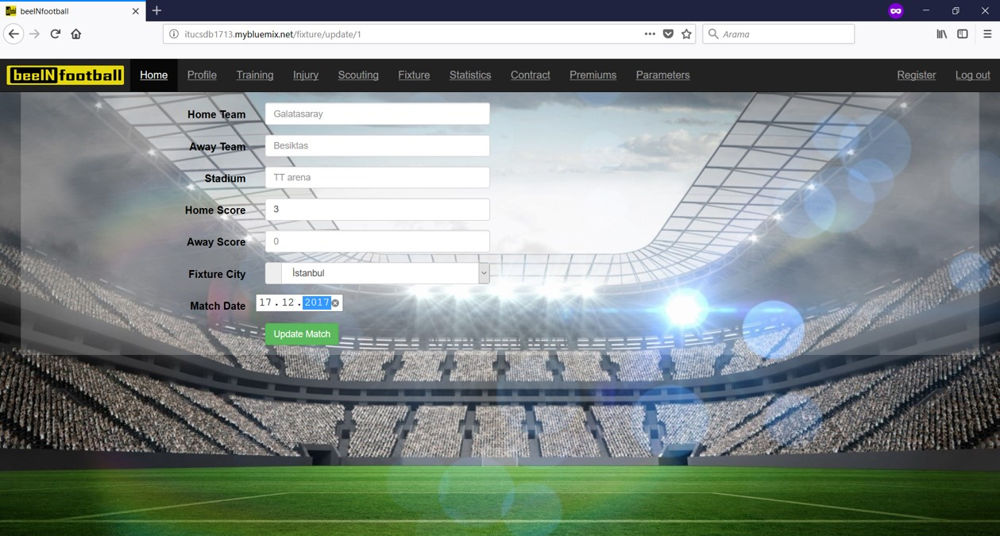
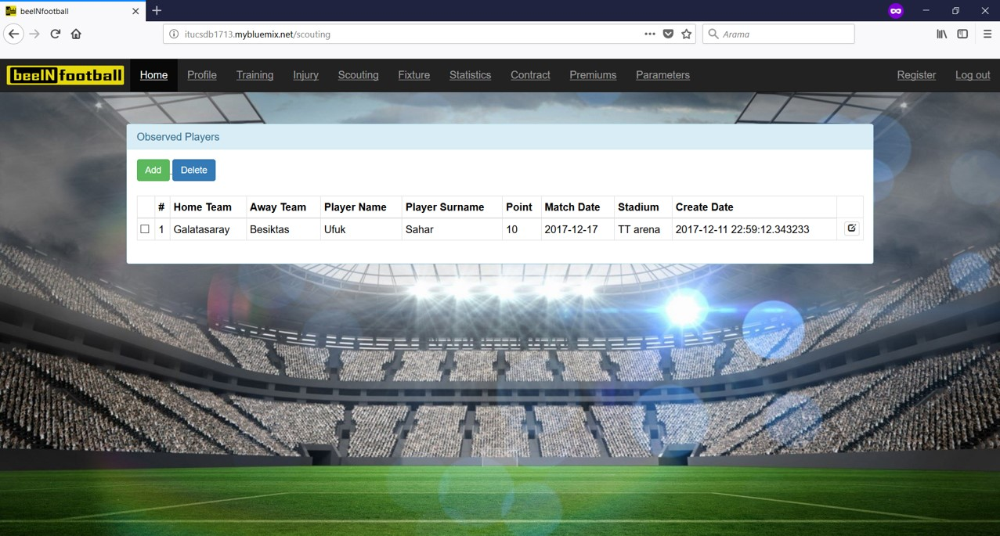
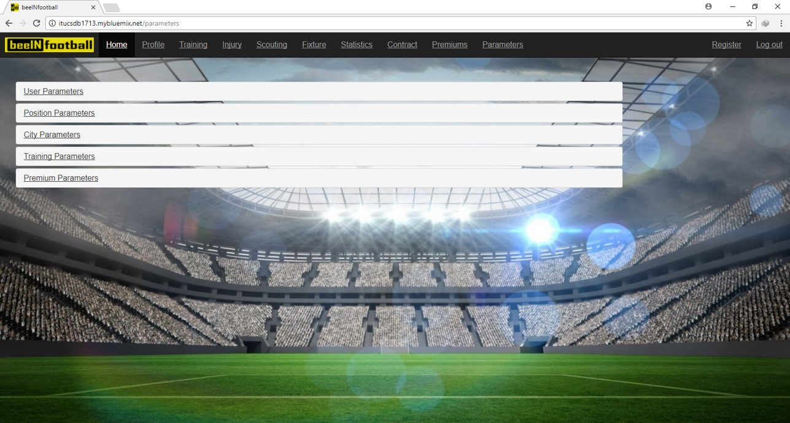
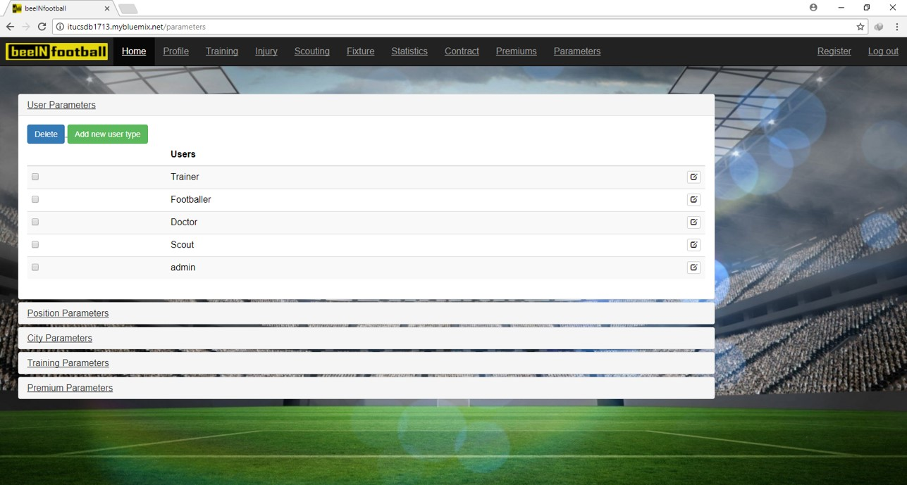
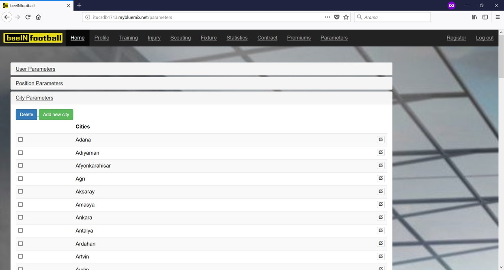

Ufuk Şahar Tarafından Yapılan Kısımlar
======================================

Antrenman Bilgisi Sayfası
-------------------------
Bu sayfada kulübün antrenman bilgileri yöneticiler(admin) veya antrenörler tarafından eklenebilir, güncellenebilir ve silinebilir. Bu sayfaya yöneticiler ve sadece antrenörler erişim sağlayabilir.

- Antrenman bilgileri

.. figure:: images/training_list.jpg
   :scale: 50 %
   :alt: Antrenman sayfası

   Antrenman sayfası görünümü

- Antrenman bilgisi ekleme

.. figure:: images/training_add.jpg
   :scale: 50 %
   :alt: Antrenman ekleme sayfası

   Antrenman ekleme sayfası görünümü

- Antrenman bilgisi güncelleme

.. figure:: images/training_edit.jpg
   :scale: 50 %
   :alt: Antrenman güncelleme sayfası

   Antrenman güncelleme sayfası görünümü

Maç Bilgisi Sayfası
-------------------------
Bu sayfada kulübün oynayacağı veya oynadığı maç bilgileri yalnızca yöneticiler(admin) tarafından eklenebilir, güncellenebilir ve silinebilir. Bu sayfaya yalnızca yöneticiler erişim sağlayabilir.

- Maç bilgileri

   Maç bilgisi sayfası görünümü

- Maç bilgisi ekleme

.. figure:: images/fixture_add.jpg
   :scale: 50 %
   :alt: Maç bilgisi ekleme sayfası

   Maç bilgisi ekleme sayfası görünümü

- Maç bilgisi güncelleme

   Maç bilgisi güncelleme sayfası görünümü

Gözlenen Futbolcular Sayfası
----------------------------
Bu sayfada gözlenen futbolcuların bilgileri yöneticiler(admin) veya gözlemciler tarafından eklenebilir, güncellenebilir ve silinebilir. Bu sayfaya yöneticiler ve sadece gözlemciler erişim sağlayabilir. Bir karşılaşmadaki futbolcunun gözlenen futbolculara eklenebilmesi için öncelikle maç bilgisinin eklenmesi gerekir. Daha sonra o maçta görev alan futbolcu gözlenen futbolculara eklenerek gözlemci tarafından puanlaması yapılır.

- Gözlenen futbolcu bilgileri

   Gözlenen futbolcular sayfası görünümü

- Gözlenen futbolcu bilgisinin ekleme

.. figure:: images/observed_add.jpg
   :scale: 50 %
   :alt: Gözlenen futbolcuları ekleme sayfası

   Gözlenen futbolcuları ekleme sayfası görünümü

- Gözlenen futbolcu bilgisinin güncellenmesi

.. figure:: images/observed_edit.jpg
   :scale: 50 %
   :alt: Gözlenen futbolcuları güncelleme sayfası

   Gözlenen futbolcuları güncelleme sayfası görünümü

Prim Bilgisi Sayfası
-------------------------
Bu sayfada futbolcuların prim bilgileri yöneticiler(admin) güncellenebilir ve silinebilir. Bu sayfaya yalnızca yöneticiler erişim sağlayabilir. Primler, futbolcunun sözleşmesine ve istatistik verisine bağlı olarak otomatik olarak hesaplanır. Yöneticiler yalnızca güncelle butonunu kullanarak primlerin otomatik olarak hesaplanması işlemini gerçekleştirirler.

- Futbolcuların prim bilgileri

.. figure:: images/premium_list.jpg
   :scale: 50 %
   :alt: Prim sayfası

   Prim sayfası görünümü

Parametre Bilgisi Sayfası
-------------------------
Bu sayfada sitede kullanılan bazı parametre bilgileri mevcuttur. Bunlar; kullanıcı tipi parametreleri (admin, Doktor, Gözlemci, Antrenör, Futbolcu vs.), şehir parametreleri (doğum yeri bilgisi ve maç şehri bilgisi), futbolcular için pozisyon/mevki parametreleri, antrenman tipi parametreleri ve prim tipi parametreleri olmak üzere diğer sayfalarda kullanılmaktadır. Yalnızca yöneticiler bu sayfaya erişim sağlayıp parametreleri ekleme, güncelleme ve silme işlemlerini gerçekleştirebilirler.

- Parametre Bilgileri

   Parametre sayfası görünümü

- Kullanıcı Tipi Parametre Bilgileri

   Parametre sayfası görünümü

- Pozisyon/Mevki Parametre Bilgileri

.. figure:: images/position_parameters.jpg
   :scale: 50 %
   :alt: Pozisyon/Mevki Parametre Bilgileri

   Parametre sayfası görünümü

- Şehir Parametre Bilgileri

   Parametre sayfası görünümü

- Antrenman Tipi Parametre Bilgileri

.. figure:: images/training_parameters.jpg
   :scale: 50 %
   :alt: Antrenman parametreleri

   Parametre sayfası görünümü

- Prim Tipi Parametre Bilgileri

.. figure:: images/premium_parameters.jpg
   :scale: 50 %
   :alt: Prim parametreleri

   Parametre sayfası görünümü
